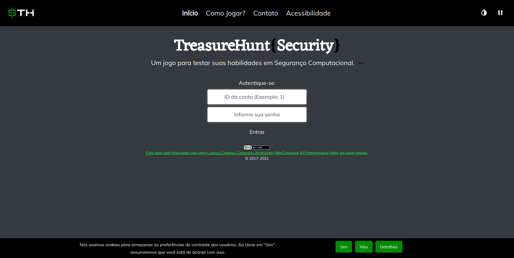
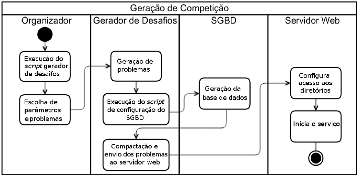
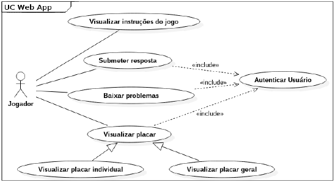

# :trophy: TreasureHunt

> Ferramenta de geração automática de problemas e competições do tipo desafio (também conhecidas como CTF _Jeopardy!_) para ensino de Segurança Computacional. 



---

## :pushpin: Tabela de Conteúdos

- [:scroll: Introdução](#scroll-Introdução)
- [:construction_worker: Arquitetura](#construction_worker-Arquitetura)
- [:electric_plug: Instalação, Configuração e Execução](#electric_plug-Instalação-Configuração-e-Execução)
- [:video_game: Como Jogar](#video_game-Como-Jogar)
- [:mailbox: Autores](#mailbox-Autores)
- [:chart_with_upwards_trend: Funcionalidades Futuras](#chart_with_upwards_trend-Funcionalidades-Futuras)
- [:tada: Como Contribuir](#tada-Como-Contribuir)
- [:closed_book: Licença](#closed_book-Licença)

---

## :scroll: Introdução

Ainda que seja uma área significativa da Computação, a Segurança Computacional apresenta um nítido contraste: a crescente demanda por profissionais _versus_ a carência de profissionais capacitados.

Um dos artifícios usados para atrair talentos em Segurança é o uso de **jogos** e **competições de segurança**, dentre os quais destacam-se os jogos do tipo _desafio_, também chamados de _caça ao tesouro_ e _capture the flag_ (CTF) _Jeopardy!_. Nestes jogos o objetivo dos jogadores é obter os textos secretos, também chamados de _flags_, ao aplicar técnicas de Segurança.

Apesar de atrativas aos jogadores, a elaboração dessas competições encara algumas dificuldades:

- Compartilhamento de resposta: _flags_ costumam ser idênticas a todos os competidores, abrindo brecha para trapaça.
- Elaboração de problemas: uma tarefa normalmente trabalhosa e manual, necessitando de conhecimento técnico.
- Reaproveitamento de problemas: problemas (e soluções), quando divulgados na _web_, perdem o "fator surpresa", imprescendível para esse tipo de jogo.

**TreasureHunt** é uma ferramenta destinada a profissionais interessados em organizar competições de Segurança do tipo _desafio_. A ferramenta se propõe a minimizar os problemas citados por meio da geração de problemas e competições de forma aleatória, automática e completa. 

---

## :construction_worker: Arquitetura

A arquitetura do projeto está descrita no Diagrama de Atividades a seguir:



Nota-se que podemos dividir o projeto em dois módulos:

- Gerador de desafios
- Sistema _Web_

### Gerador de desafios: 

O gerador de desafios é acionado pelo organizador da competição. Ele é composto por um conjunto de _scripts_, elaborados para serem executados em ambientes _Unix-like_, e diretórios com recursos como imagens, textos e códigos, localizados em [`TreasureHunt/Jogo`](/Jogo). Esses diretórios são usados como base para a criação de instâncias únicas de problemas. Ainda que exista um conjunto de arquivos (images, textos e códigos) padrão utilizado para gerar as instâncias de problemas, o organizador pode editá-los, removê-los ou adicionar novos arquivos a seu critério. 

Os _scripts_ são responsáveis por montar a competição, gerar instâncias de problemas e _flags_ únicas para cada jogador, bem como configurar o Sistema de Gerenciamento de Banco de Dados (SGBD). O _script_ principal é chamado de [`Jogo.sh`](Jogo/Scripts/Jogo.sh). Ele recebe a quantidade de jogadores e problemas, depois, em ordem, recebe as técnicas que comporão cada problema. Um problema pode aplicar técnicas únicas ou compostas de acordo com as entradas do organizador. Por fim, as entradas são validadas, prosseguindo na criação dos arquivos compactados (em formato .zip) que serão enviados para o Servidor _Web_ e na configuração do SGBD. A imagem a seguir demonstra a execução do _script_ principal:


### Sistema _Web_:

É o componente com o qual os jogadores interagem, localizando-se em [`TreasureHunt/TreasureHunt`](/TreasureHunt). Através dele os usuários podem realizar as seguintes ações listadas abaixo e expostas no Diagrama de Casos de Uso:

- Visualizar Instruções e o contato com os desenvolvedores
- Baixar problemas (exige autenticação)
- Submeter respostas (exige autenticação)
- Visualizar o placar indivual ou geral (exige autenticação)



As respostas (_flags_) estão presentes nos arquivos disponibilizados aos jogadores. Para serem descobertas, é necessário que o jogador utilize técnicas corretas, tais como descriptografia de _base64_ ou Cifra de César, por exemplo.

Os acessos e as submissões de respostas por meio do Sistema _Web_ podem ser verificados pelo organizador no Banco de Dados `TreasureHunt`. Nele ficam registrados os dados da competição, inclusive o endereço IP dos jogadores, garantindo que uma conta não tenha sido compartilhada, por exemplo. Vale lembrar que boas práticas de Segurança são aplicadas nos dados sensíveis, tais como o uso de _hash_ e _salt_.

Além disso, a interface _web_ do TreasureHunt é responsiva e foi otimizada para ser **acessível** de acordo com os critérios da [WCAG](https://www.w3.org/WAI/standards-guidelines/wcag/) (_Web Content Accessibility Guidelines_, Diretrizes de Acessibilidade para o Conteúdo da _Web_). Dos 87 critérios de acessibilidade avaliados (versão 2.1 da WCAG e esboços da versão 2.2), a interface _web_ do TreasureHunt cumpre 72, o que corresponde a 97,29% do total (74), quando se exclui os que não se aplicam (13), tal como os critérios relacionados a vídeos ou sons que não estão presentes no _site_. Por consequência, a interface falha em apenas dois critérios, como pode ser observado na [planilha online de critérios de acessibilidade cumpridos pela interface web do TreasureHunt](https://docs.google.com/spreadsheets/d/1QwY4zQd_fF0Rss1fDj7d06v2b5BDnO0CrUsNnYmKyMU/edit#gid=0). Nessa planilha também é possível fazer um comparativo com outras interfaces web de jogos de Segurança Computacional e com a versão de 2020 do TreasureHunt. 

Com o objetivo de ser cada vez mais acessível, o _website_ é testado por meio de validadores automáticos de acessibilidade e de testes manuais, como o uso de leitores de tela e simuladores de daltonismo. Alguns dos recursos de acessibilidade da interface _web_ do TreasureHunt estão descritos na página "acessibilidade", que explica e auxilia a utilização de alguns deles. Dentre os recursos de acessibilidade do TreasureHunt podemos citar:  

- relação de contraste acima de 4,5:1 em todo o website e um modo de alto contraste com relação superior a 7:1
- suporte para navegação por teclado 
- minimização do uso de JavaScript em recursos essenciais 
- layout responsivo e adaptável mesmo com grande zoom 
- mensagens significativas de correção de erros na submissão de formulários 
- opção de desativar as animações não essenciais da página 

---

## :electric_plug: Instalação, Configuração e Execução

Para promover uma competição com o TreasureHunt é necessário seguir os seguintes passos:

1. Clonagem do repositório
2. Execução do _script_ de instalação de requisitos
3. Configuração e inicialização do servidor _web_
4. Execução do _script_ de geração de competições

Passos adicionais, tais como instalação de ferramentas alternativas ou configuração de servidores instalados, podem ser necessários. Leia também a seção sobre [Notas adicionais sobre instalação, configuração e execução](#Notas-adicionais-sobre-instalação-configuração-e-execução). 

O restante dessa seção descreve detalhadamente cada um dos passos sugeridos.

### Clonagem do repositório

Para copiar o repositório, execute o seguinte comando [Git](https://git-scm.com/) em um terminal:

```sh
 git clone https://github.com/TreasureHuntGame/TreasureHunt.git
```

Para prosseguir a instalação, certifique-se de estar no diretório do TreasureHunt:

```sh
cd TreasureHunt
```

### Execução do _script_ de instalação de requisitos

Após baixar o repositório para a sua máquina, o próximo passo é fazer a instalação dos requisitos do projeto. Para isto, basta executar o _script_ [`instalador.sh`](/Instalador/instalador.sh), localizado em [`TreasureHunt/Instalador`](/Instalador), que se encarrega de instalar todos os pacotes, que por padrão se encontram no arquivo [`requisitos.txt`](/Instalador/requisitos.txt).

```sh
cd Instalador
chmod +x instalador.sh
./instalador.sh
```

Para as máquinas dos jogadores, sugere-se que estas tenham pelo menos as seguintes ferramentas (ou equivalentes):

- awk
- base32
- base64
- caesar
- outguess
- sed
- sh
- strings
- Editor de texto
- Navegador _web_

Cabe ao organizador da competição decidir se fornece ou não as ferramentas.

### Configuração e Inicialização do Servidor _Web_

Para iniciar a interface _web_ basta seguir os seguintes passos:

1. Copie o diretório [/TreasureHunt](/TreasureHunt) para o diretório do servido _web_. Dependendo do sistema operacional e do servidor _web_ este se localizará em locais diferentes. Exemplos: `C:\xampp\htdocs` com o Xampp no Windows ou `/var/www/html/TreasureHunt/` em certas distribuições Linux:

```sh
cp TreasureHunt /var/www/html/TreasureHunt/
```

2. Inicie o servidor _web_. Exemplo de inicialização do apache: 

```sh
sudo service apache2 start
```

3. Forneça acesso aos jogadores através do _link_ gerado pelo [`ngrok`](https://ngrok.com/) ou informando seu endereço IP. Neste caso, verifique em sua interface de rede, por exemplo, digitando ``ifconfig``.

4. Forneça um identificador de usuário (ID) e uma senha de acesso a cada jogador. Eles usarão essas informações para se autenticar na aplicação _web_ posteriormente.

5. Acompanhe o jogo pelo tempo que achar necessário. Sugere-se projetar o placar geral para os jogadores.

6. Finalize a competição quando e como desejar, por exemplo, parando o servidor. Exemplo de parada do apache:

```sh
sudo service apache2 stop
```

Ao finalizar o jogo, as respostas e submissões estarão armazenadas na base de dados ``TreasureHunt`` no MySQL. Sugere-se a realização de _backup_ dos dados através do comando ``mysqldump -u root TreasureHunt > backup.sql`` (supondo usuário ``root``e _database_ ``TreasureHunt``.)

### Execução do _script_ de geração de competições

As competições de TreasureHunt precisam ser criadas pelo organizador. Para tanto, este deve escolher a quantidade de participantes, bem como quantos e quais desafios estarão presentes, podendo inclusive adicionar um problema composto, com duas técnicas aplicadas em conjunto.

Para gerar a competição, basta executar o _script_ [`Jogo.sh`](/Jogo/Scripts/Jogo.sh) do diretório [TreasureHunt/Jogo/Scripts/](/Jogo/Scripts).

```sh
cd Jogo/Scripts
chmod +x Jogo.sh
./Jogo.sh
```

Alternativamente, o _script_ pode ser executado com o comando ``bash``:

```sh
bash Jogo.sh
```

#### Opções de Problemas

O TreasureHunt permite que o organizador da competição gere problemas a partir de um rol de técnicas selecionadas e implementadas. Atualmente é possível gerar problemas envolvendo as técnicas abaixo:

- Comentário em código-fonte de página HTML (_HyperText Markup Language_)
- Comentário no arquivo `robots.txt`
- (De)codificação de arquivo em base64
- (De)codificação de arquivo em base32
- (Des)criptografia de Cifra de César
- (De)codificação de caractere ASCII (_American Standart Code for Information Interchange_)
- Descompilação de binário e obtenção de código fonte Java
- Descompilação de binário e obtenção de código fonte Python
- Esteganografia em imagens

Vale lembrar que os problemas podem ser compostos por duas técnicas, ainda que nem todas as combinações sejam possíveis (o _script_ avisará o organizador neste caso). Além disso, a ordem de composição das técnicas interfere no problema (não é comutativa) e na sequência de passos necessários para solucioná-lo.

Com o fim desses passos, o esquema e as tabelas também terão sido criadas automaticamente no Banco de Dados.

### Notas adicionais sobre instalação, configuração e execução

Pressupõe-se algumas condições para que instalação, configuração e execução ocorram com sucesso. Essas indicações, bem como alguns dos erros comuns serão destacados a seguir:

- *Nota 1*: É necessário obter privilégios de leitura e escrita no diretório do servidor _web_ (por exemplo: ``/var/www/html/TreasureHunt/``).

- *Nota 2*: O _script_ considera que o MySQL será utilizado com usuário ``root`` e sem senha. O organizador pode alterar isso manipulando a chamada ao _script_ ``ConfiguraBD.sh`` no arquivo ``Jogo.sh``.

- *Nota 3*: O _script_ considera que o MySQL será utilizado sem a diretiva ``NO_ZERO_DATE``. Para removê-la, uma dessas soluções pode ser empregada (a depender da versão do MySQL) no arquivo de configuração, `my.ini` no Windows ou `my.cnf` (`/etc/mysql/`) em sistemas _Unix-like_, após o indicador `[mysqld]:` (adicionar caso não esteja presente):

(testado na versão 5.7.30):

``sql_mode = "ONLY_FULL_GROUP_BY,STRICT_TRANS_TABLES,NO_ZERO_IN_DATE,ERROR_FOR_DIVISION_BY_ZERO,NO_AUTO_CREATE_USER,NO_ENGINE_SUBSTITUTION"``

(testado na versão 8.0.23):

``sql_mode="ALLOW_INVALID_DATES"``

Depois, reinicie o MySQL (``sudo service mysql restart``) e tente novamente. Você também pode verificar se a diretiva foi removida entrando no MySQL e digitando no console: ``SHOW VARIABLES LIKE 'sql_mode';``. 

- *Nota 4*: O arquivo ``apache2.conf``, disponível no diretório ``TreasureHunt/TreasureHunt``, serve apenas como exemplo de configuração do servidor _web_. O organizador pode configurá-lo de maneira diferente, a seu critério.

- *Nota 5*: Arquivos de texto podem apresentar problemas se codificados com iso 8859-1. Prefira utf-8 ou us-ascii.

- *Nota 6*: Se você obtiver a mensagem `ERROR 1698 (28000): Access denied for user 'root'@'localhost'` ao final do _script_, verifique o valor _default_ de autenticação para o seu usuário e altere-o. Isso pode ser feito seguindo os passos abaixo (exemplo para o usuário `root`):

```SQL
> sudo mysql -u root
mysql> USE mysql;
mysql> SELECT User, Host, plugin FROM mysql.user;
mysql> UPDATE user SET plugin='mysql_native_password' WHERE User='root';
mysql> FLUSH PRIVILEGES;
mysql> exit;
> service mysql restart
```
- *Nota 7*: Se você obtiver a mensagem de erro `Bad substitution` ao executar o _script_ `Jogo.sh`, tente executar o _script_ com o comando `bash Jogo.sh`.

- *Nota 8*: alguns navegadores podem restringir o acesso a _websites_ que não possuem um certificado SSL/TLS (HTTPS). Caso a sua hospedagem do TreasureHunt esteja limitada ao HTTP, certifique-se de orientar os competidores a desativarem tal configuração.

- *Nota 9*: A fim de evitar ataques de _Clickjacking_, sugere-se a configuração do cabeçalho de resposta HTTP `X-Frame-Options`. Para isso, o módulo de cabeçalhos (_headers_) precisa estar ativo:
```
> a2enmod headers
> service apache2 restart
```
Depois disso, altere o arquivo `/etc/apache2/conf-enabled/security.conf` ou equivalente para definir o valor de `X-Frame-Options`. Sugestão de diretiva:
```
Header set X-Frame-Options: "DENY"
```
Novamente é necessário reiniciar o servidor: `service apache2 start`.

Outra solução possível, esta mais simples, seria adicionar o cabeçalho diretamente por PHP com `header("X-Frame-Options: DENY");`, o que já foi feito nos arquivos PHP deste jogo. No entanto, tal medida ainda não impede que arquivos de outros tipos (por exemplo, XML) possam ser carregados em _frames_.

---

## :video_game: Como Jogar

### Descrição do jogo

Por meio da interface _web_, os jogadores podem:

- Ler as intruções do jogo e o contato dos desenvolvedores
- Baixar o arquivo com os seus respectivos problemas 
- Enviar as respostas (_flags_) dos problemas
- Exibir o placar individual 
- Exibir o placar geral

Apesar disso, para visualizar o placar individual, baixar os problemas e submeter as respostas é preciso acessar a página principal, o que requer que o usuário esteja autenticado, ou seja, é preciso fazer _login_ com o ID e senha fornecidos pelo organizador da competição. A figura a seguir mostra a página principal que contém os recursos citados. O placar geral, outro recurso que depende de autenticação, pode ser acessado na opção ``Placar`` na barra de navegação (topo da figura).  


Dessa forma, os passos necessários para jogar o TreasureHunt são:

1. Autenticar-se no _site_ com ID e senha. 
2. Baixar o arquivo compactado com os problemas e descompactá-lo. Sugere-se o comando ``unzip jogadorX.zip``, em que X é o ID numérico do usuário. Os diretórios dentro do arquivo compactado são números que representam o ID do problema. Dentro de cada diretório há um ou mais arquivos que precisam ser analisados para se obter a _flag_ do respectivo problema.
3. Utilizar ferramentas adequadas e encontrar as _flags_ nos arquivos. O jogador tem a liberdade de resolver os problemas na ordem que preferir, pois o jogo não é linear. As _flags_ estarão sempre no formato ``TreasureHunt{TEXTO_ALEATÓRIO}``. Exemplo: ``TreasureHunt{xjYui87aZl}``.
4. Submeter a _flag_ juntamente do número identificador do diretório (ID do problema) no qual a _flag_ foi encontrada.

Após submeter uma _flag_, o jogador receberá uma das seguintes respostas:

- **Problema com ID inválido**: refere-se ao número do problema, o mesmo que nomeia o diretório. Este erro indica que o número informado não corresponde aos problemas do jogo. Exemplos: números negativos ou maiores que a quantidade de questões da competição.
- **Errou!**: a _flag_ está com o formato correto, mas a resposta está incorreta.
- **Errou! Considere submeter a flag no seguinte formato: TreasureHunt{texto-aleatorio}**: indica que o formato da _flag_ está incorreto.
- **Você já acertou a questão ID_problema!**: essa questão já foi respondida corretamente anteriormente (um acerto não é contado duas vezes).
- **Acertou! n/m**: a questão foi respondida corretamente. É indicada quantas questões (n) do total (m) já foram acertadas.

Ao longo da competição o jogador tem a opção de visualizar quais problemas faltam ser resolvidos no placar indivual e sua colocação em relação aos demais jogadores no placar geral.

Vencerá o jogo aquele que submeter mais respostas em menos tempo, ou seja, em caso de empate no número de acertos, permanecerá à frente aquele que submeteu a última resposta correta primeiro.

Vale lembrar que para a execução dos problemas recomenda-se um conjunto mínimo de ferramentas, descritas no final da seção [Execução do _script_ de instalação de requisitos](#Execução-do-script-de-instalação-de-requisitos). Apesar disso, o jogador é livre para escolher a forma como resolverá os problemas, incluindo ferramentas alternativas ou _scripts_ automatizados para a resolução dos problemas.

---

## :mailbox: Autores

### Equipe atual

- Ricardo de la Rocha Ladeira: [ricardo.ladeira@ifc.edu.br](mailto:ricardo.ladeira@ifc.edu.br)
- Camily do Nascimento Ghellar: [ghellarcamily@gmail.com](mailto:ghellarcamily@gmail.com)
- Gabriel Eduardo Lima: [limaedugabriel@gmail.com](mailto:limaedugabriel@gmail.com)

### Contribuidores

- Henrique Arnicheski Dalposso
- Lucas Vargas
- Rafael Rodrigues Obelheiro
- Richard Robert Dias Custódio
- Vinícius Manuel Martins
- Vitor Augusto Ueno Otto

---

## :chart_with_upwards_trend: Funcionalidades Futuras

Este projeto se mantém em constante atualização, o que significa que novas funcionalidades e aperfeiçoamentos seguem em pauta. Dentre as funcionalidades planejadas, pretende-se:

- Implementar novos problemas no gerador de desafios, em especial da classe de problemas _web_
- Permitir que mais de duas técnicas componham um problema (por exemplo, elaborar um problema que envolva base64, base32 e Cifra de César)
- Permitir que mais de uma ferramenta seja utilizada por técnica (por exemplo, elaborar problemas de esteganografia envolvendo `outguess`, `f5.jar` e/ou `steghide`)
- Permitir o cadastro autônomo e o gerenciamento das contas de usuários
- Permitir a parametrizaço de pontos, ou seja, atribuir pontuações diferentes aos problemas
- Implementar um recurso para inserção de dicas
- Adicionar identificadores às competições, permitindo melhor acompanhamento da evolução dos jogadores, por exemplo.
- Fornecer uma interface de treinamento inteligente para analisar as respostas e o tempo levado pelos jogadores para recomendar problemas de dificuldade adequada.

---

## :tada: Como Contribuir

Sua contribuição é bem-vinda no projeto! Sinta-se livre para relatar _bugs_, impressões ou sugerir mudanças, tanto por meio da criação de **issues** e **pull requests** quanto pelo contato direto com a [equipe atual](#Equipe-atual). Pedimos apenas que utilize uma linguagem clara, descrevendo o seu ambiente e o passo a passo para reproduzir o _bug_. Seja breve e objetivo, mostrando _prints_ se possível.

---

## :closed_book: Licença

<a rel="license" href="http://creativecommons.org/licenses/by-nc/4.0/"></a><br /><span xmlns:dct="http://purl.org/dc/terms/" property="dct:title">TreasureHunt{Security}</span> de <a xmlns:cc="http://creativecommons.org/ns#" href="https://github.com/TreasureHuntGame/TreasureHunt" property="cc:attributionName" rel="cc:attributionURL">Ricardo de la Rocha Ladeira</a> está licenciado com uma Licença <a rel="license" href="http://creativecommons.org/licenses/by-nc/4.0/">Creative Commons - Atribuição-NãoComercial 4.0 Internacional</a>.
<br />Baseado no trabalho disponível em <a xmlns:dct="http://purl.org/dc/terms/" href="https://github.com/TreasureHuntGame/TreasureHunt" rel="dct:source">https://github.com/TreasureHuntGame/TreasureHunt</a>.

---
